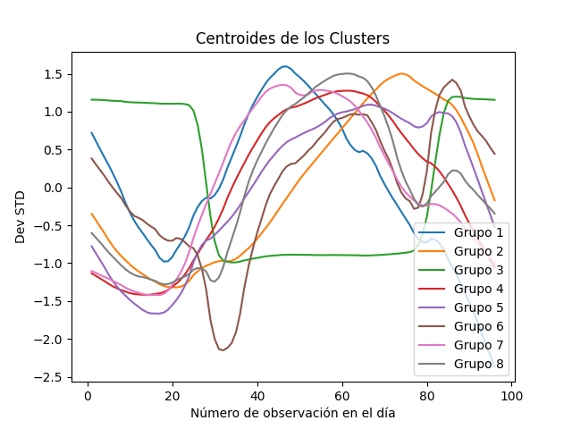

# Resultados

## Análisis EDA

Se observa que existentes tendencias de comportamiento en el consumo diario entre los distintos clientes que permiten naturalmente agrupar los datos, se debe tener en cuenta un proceso de normalización a fin de evitar el agrupamiento por escalas de consumo y aprovechar la dinámica de la señal para poder emplear esa información en determinar el comportamiento en el tiempo (t + 1), con el histórico de información funcionando como buffer o clases a priori de comportamiento.

Al utilizar series de tiempo como los perfiles de carga eléctrica, se recomienda tener un proceso de normalización a fin de tener los datos en una misma escala, dado que si se realiza un análisis de clustering o clasificación no se vea afectado por las escalas si lo que se desea comparar es la dinámica (tendencia) de las señales con respecto a las demás.

En el gráfico final se observan los centroides de los clusters encontrados, estos se definen como la media del conjunto de datos o como punto de equilibrio "centro de gravedad" de los datos, estos centroides pueden ser empleados como clases apriori si lo que se desea buscar es una clasificación basado en los 8 patrones encontrados. 

## Streamlit & Altair

Se agregan los resultados de la integración de Streamlit y Altair con el análisis EDA, para desplegar gráficos interactivos y hacer la difusión del proyecto. Esta integración permite comunicar los resultados desde un aplicativo web. Los gráficos interactivos agregados en la sección de resultados permiten realizar los clústeres formados y visualizar las señales eléctricas agrupadas con base en la información del dataframe.
